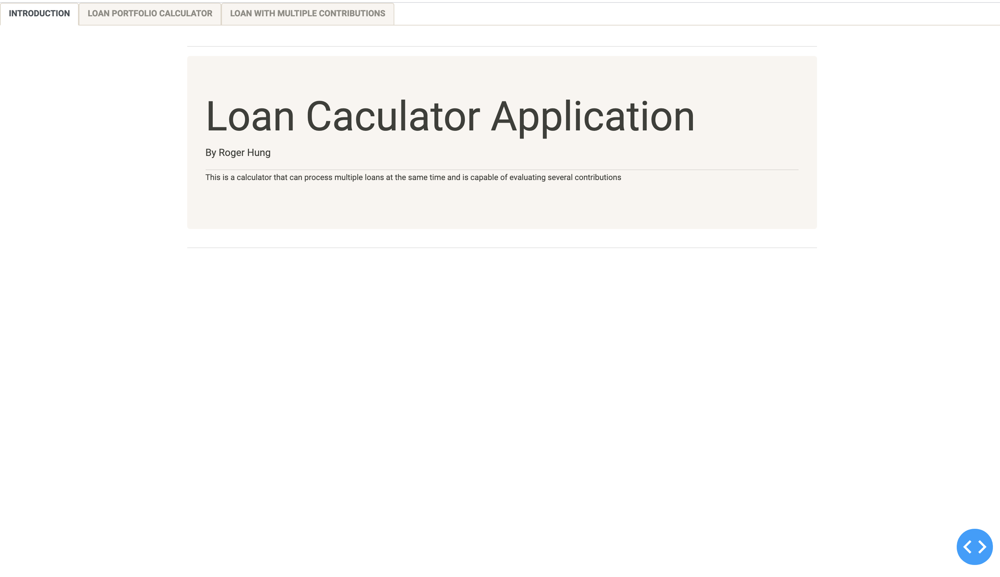
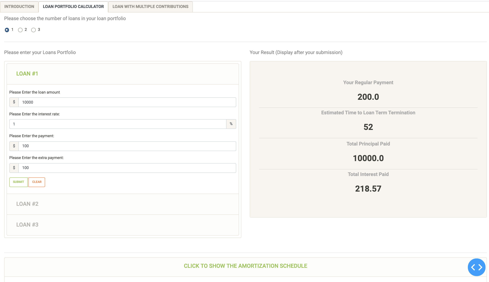

# Loan Calculator with Dash Web Analytic Application
### Topic: Loan Analytics
### Author: Roger Hung
<br >
<strong>This loan calculator is capable of computing the the amortization schedule of a personal loan or even a loan portfolio. On top of that, this application can also take into account multiple contributions from different people, say your family member or friends.</strong> <br >

<br >
This loan calculator has two tabs:

- Loan portfolio calculator: Here you can enter information of your loans, including principal, interest rate, payment, extra payment for up to three loans. 

- Loan with financial assistance: This is a calculator that allows you to specify how many people are supporting you on the loan payment (contributions).






# Get Started

Running the dash app on your local server

```cmd
$python loan_app.py
```

# Reference
1. https://dash-bootstrap-components.opensource.faculty.ai/docs/quickstart/
2. https://dash.plotly.com/introduction


